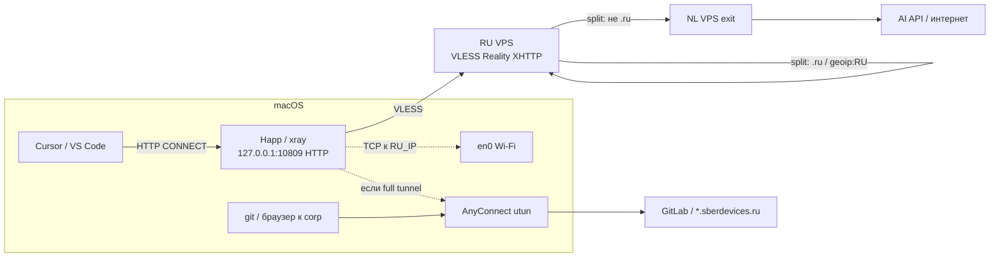
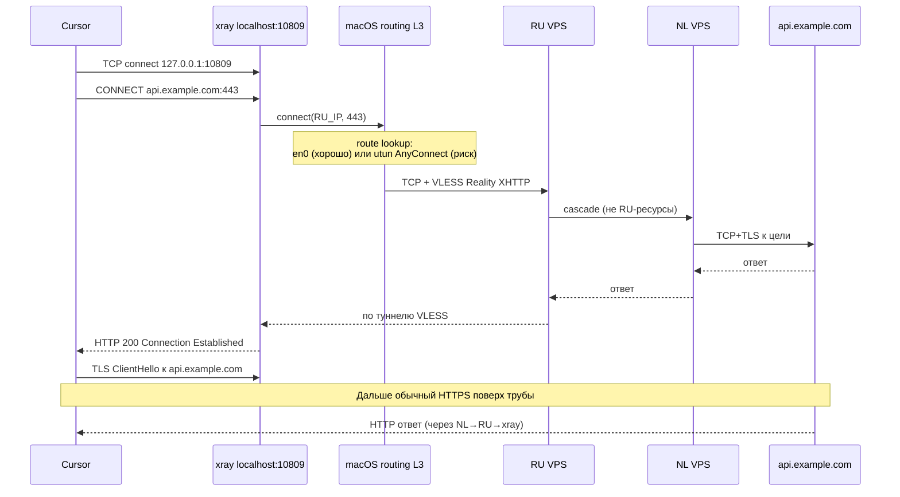
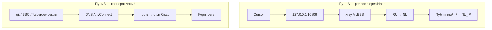
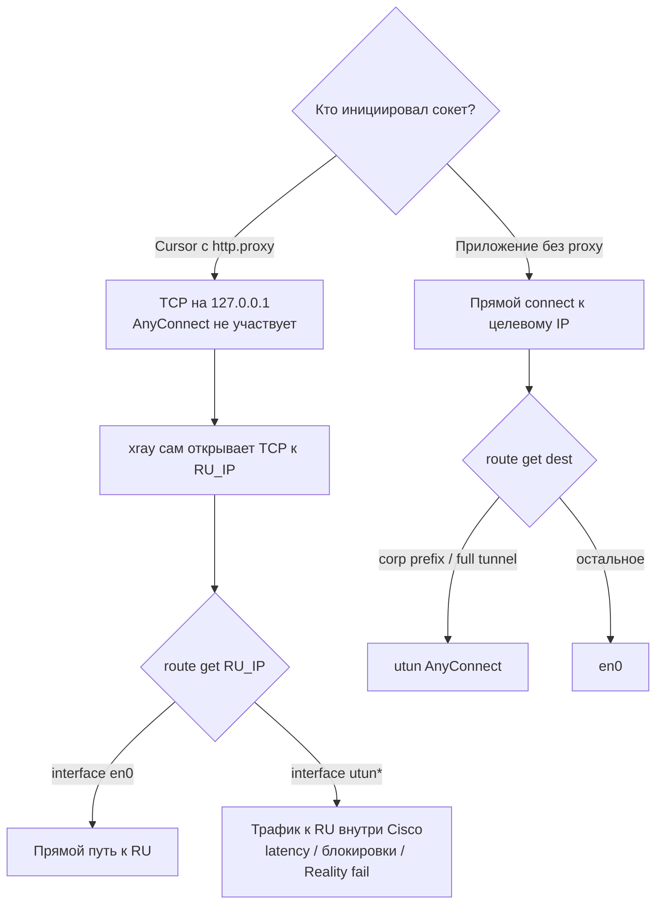

# Per-app proxy на macOS через Happ (Cursor / VS Code)

Гайд для рабочей машины с **корпоративным VPN (Cisco AnyConnect)** и личным каскадом из [PROXY-CASCADE-QUICKSTART.md](./PROXY-CASCADE-QUICKSTART.md).

Цель: **только выбранные приложения** (Cursor, при необходимости Codex / Claude) ходят в интернет через каскад **RU → NL**, а корпоративные ресурсы (`*.sberdevices.ru`, GitLab и т.п.) — через AnyConnect.

Серверная часть (inbound `admin-ru`, Reality + XHTTP, split-routing) считается уже рабочей; на телефоне VLESS-ссылка импортируется в v2rayNG / Nekobox.

---

## Переменные

| Переменная | Описание | Пример |
|------------|----------|--------|
| `RU_IP` | Публичный IP входного VPS | `203.0.113.10` |
| `NL_IP` | Публичный IP exit VPS (ожидаемый IP через прокси) | `198.51.100.20` |
| `LOCAL_HTTP` | Локальный HTTP-прокси Happ/xray | `127.0.0.1:10809` |
| `LOCAL_SOCKS` | Локальный SOCKS5 Happ/xray | `127.0.0.1:10808` |

Типичные порты Desktop Happ: **SOCKS `10808`**, **HTTP `10809`**. Точные значения смотри в UI (**Inbounds**) или через `lsof` (ниже).

---

## Зачем локальный клиент (Happ), а не «просто http.proxy на RU_IP»

**VLESS + Reality + XHTTP на `RU_IP:443` — это не HTTP-прокси.**

Cursor / VS Code в `settings.json` понимают обычный HTTP(S)-прокси вида:

```text
http://127.0.0.1:10809
```

Они **не** умеют говорить на протоколе VLESS. Нужен адаптер:

```text
Cursor ── HTTP CONNECT ──► localhost (Happ/xray)
                              │
                              └── VLESS + Reality + XHTTP ──► RU ──► NL
```

Happ здесь — GUI над ядром (часто **xray**): поднимает локальные inbound HTTP/SOCKS и исходящий VLESS к вашему inbound.

Подробнее, почему «удалённый nginx/HTTP на RU вместо Happ» обычно плохая идея — в конце документа ([FAQ](#faq-можно-ли-без-happ--http-на-ru)).

---

## Режимы Happ (Desktop)

На главном экране / в dropdown транспорта (актуальные Desktop-сборки): **Proxy**, **TUN** (с выбором ядра), **Mixed**.

| Режим | Что делает | Интерфейсы / механизм | С AnyConnect |
|-------|------------|------------------------|--------------|
| **Proxy** | Локальный HTTP/SOCKS на `127.0.0.1`. Может **не** трогать system proxy macOS | Userspace listen; без своего `utun` для всего трафика | **Рекомендуется** |
| **TUN** | Виртуальный адаптер + маршруты ядра — «как VPN» на L3 | Свой `utunN` | Высокий риск конфликта с Cisco |
| **Mixed** | Proxy **и** TUN одновременно | localhost + `utun` | Не использовать как default |
| **Use local DNS** | DNS через туннель | DNS path | С AnyConnect может сломать `*.sberdevices.ru` |

### Ядра TUN (если всё же смотрите TUN)

Это не разные «виды интернета», а **разные реализации** одного класса задач — захвата IP через TUN:

| Вариант в UI | Суть |
|--------------|------|
| **sing-box** | TUN/стек через ядро sing-box |
| **Xray TUN** | TUN-провайдер, связанный с Xray |
| **tun2proxy** | Трафик с TUN сваливается в локальный SOCKS/HTTP, дальше уже прокси-ядро |

**Название TUN:** в Unix/macOS виртуальный сетевой device типа `tun`/`utun` принимает IP-пакеты (L3). Режим так и назван: «гоняем трафик ОС через TUN».

Для этой задачи держите **только Proxy**, TUN/Mixed/local DNS — выключены.

---

## Слои протоколов: кто на каком уровне

Упрощённый стек исходящего запроса Cursor к API (например `api.ipify.org`):

| Уровень | Что происходит |
|---------|----------------|
| Приложение | Cursor решает идти на `http.proxy` → `127.0.0.1:10809` |
| L4 (TCP) | TCP к localhost:10809 |
| HTTP (прокси) | `CONNECT api.ipify.org:443` → ответ `200 Connection Established` |
| TLS | Cursor поднимает TLS к целевому хосту **поверх** трубы через прокси |
| Дальше внутри xray | Инкапсуляция в **VLESS**, транспорт **XHTTP**, маскировка **Reality** |
| L3 на Mac | Исходящий сокет xray → `RU_IP:443`: ядро выбирает маршрут (`en0` или `utun` AnyConnect) |
| AnyConnect | Если маршрут на `RU_IP` через `utun` Cisco — пакеты к RU идут **внутри корп. VPN** (часто плохо) |
| RU / NL | Split-routing на RU; зарубежное → NL; ответ обратно по той же логической цепочке |

**Важно:** Happ в режиме Proxy **не перехватывает** чужие пакеты на L3. Cursor **сам** открывает соединение на localhost. GitLab без `http.proxy` идёт своим путём — обычно в `utun` AnyConnect.

---

## Схемы (Mermaid)

### 1. Общая архитектура per-app



### 2. Как формируется запрос (HTTP CONNECT → VLESS)



### 3. Два параллельных пути на одном Mac



### 4. Где «перехват» AnyConnect (и где его нет)



---

## Пошаговая настройка

### 1. Happ: профиль и режим

1. Установить Happ Desktop, импортировать ту же VLESS-подписку / ссылку, что на телефоне (`admin-ru`).
2. Убедиться, что пинг профиля проходит.
3. Транспорт: **только Proxy** (не Mixed, не TUN).
4. **Use local DNS** — выключить.
5. Connect.

Порты локального прокси:

- UI: **Settings → Inbounds** (в новых версиях порты перенесены сюда; HTTP inbound иногда **выключен по умолчанию** — включить).
- Либо блок Allow LAN (порты read-only) — для Cursor всё равно используйте `127.0.0.1`, не LAN IP.

### 2. Проверки в Terminal

См. раздел [Команды](#команды-с-объяснением-аргументов).

Ожидание:

- `curl --proxy http://127.0.0.1:10809 https://api.ipify.org` → **`NL_IP`**
- `curl --noproxy '*' https://api.ipify.org` → другой IP (домашний / корпоративный выход)
- `scutil --proxy` → часто **пустой** словарь — system proxy выключен (для per-app это нормально и даже желательно)
- `route -n get RU_IP` → желательно **не** `utun*`

### 3. Cursor

**Settings UI:** `Cmd + ,` → поиск `proxy` → **Http: Proxy** =

```text
http://127.0.0.1:10809
```

**Http: Proxy Support** → `override`.

Или User Settings JSON (`Cmd + Shift + P` → **Preferences: Open User Settings (JSON)**):

```json
{
  "http.proxy": "http://127.0.0.1:10809",
  "http.proxySupport": "override"
}
```

Полностью Quit Cursor и открыть снова.

Опционально исключения (если корп. трафик из Cursor уезжает в NL):

```json
{
  "http.noProxy": "localhost,127.0.0.1,*.sberdevices.ru"
}
```

### 4. VS Code

Те же ключи `http.proxy` / `http.proxySupport` в VS Code User Settings.

### 5. Если часть агента игнорирует settings

Запуск из Terminal (после Connect в Happ):

```bash
export HTTP_PROXY=http://127.0.0.1:10809
export HTTPS_PROXY=http://127.0.0.1:10809
export ALL_PROXY=socks5h://127.0.0.1:10808
export NO_PROXY=localhost,127.0.0.1,*.sberdevices.ru
open -a Cursor
```

Не открывать тот же Cursor ярлыком из Dock в этой сессии без env — будет другой процесс без переменных.

### 6. Критерий «готово»

| Проверка | Ок |
|----------|-----|
| Happ | Proxy only, Connected |
| curl через `10809` | `NL_IP` |
| curl без прокси | другой IP |
| Cursor | чат/модели работают при Happ ON |
| Happ OFF | Cursor к API отваливается (значит реально через proxy) |
| GitLab / `*.sberdevices.ru` | работают через AnyConnect |

---

## Команды с объяснением аргументов

### Архитектура Mac

```bash
uname -m
```

| Часть | Смысл |
|-------|--------|
| `uname` | Имя/информация о системе |
| `-m` | Machine hardware — на Apple Silicon ожидается `arm64` |

### Системный прокси macOS

```bash
scutil --proxy
```

| Часть | Смысл |
|-------|--------|
| `scutil` | Утилита System Configuration (сеть, DNS, proxy) |
| `--proxy` | Показать **активный system-wide** HTTP/HTTPS/SOCKS/PAC |

Пустой `<dictionary> { }` = системный прокси **выключен**. Это **не** значит, что Happ не слушает localhost.

### Кто слушает локальные порты

```bash
lsof -nP -iTCP -sTCP:LISTEN
```

| Часть | Смысл |
|-------|--------|
| `lsof` | List open files (в т.ч. сокеты) |
| `-n` | Не резолвить IP в имена |
| `-P` | Не подменять порты именами сервисов (`10809`, не `http-alt`) |
| `-iTCP` | Только TCP |
| `-sTCP:LISTEN` | Только слушающие сокеты |

Фильтр по Happ/xray:

```bash
lsof -nP -iTCP -sTCP:LISTEN | grep -iE 'xray|Happ|sing'
```

Ожидаемые строки при Connected (пример):

```text
xray  ...  TCP 127.0.0.1:10809 (LISTEN)   # HTTP
xray  ...  TCP 127.0.0.1:10808 (LISTEN)   # SOCKS
xray  ...  TCP 127.0.0.1:11111 (LISTEN)   # служебный порт Happ — для Cursor не нужен
```

Быстрая проверка типичных портов:

```bash
for p in 10808 10809 1080 7890 2080 2081; do
  nc -z -G 1 127.0.0.1 $p && echo "OPEN $p"
done
```

| Часть | Смысл |
|-------|--------|
| `nc` | netcat — проверка TCP |
| `-z` | Только probe, без передачи данных |
| `-G 1` | Таймаут connect (секунды, macOS) |
| `$p` | Порт из цикла |

### Исходящий IP через локальный HTTP-прокси

```bash
curl --connect-timeout 15 --proxy http://127.0.0.1:10809 https://api.ipify.org
echo
```

| Часть | Смысл |
|-------|--------|
| `curl` | HTTP(S)-клиент |
| `--connect-timeout 15` | Не ждать TCP дольше 15 с |
| `--proxy http://127.0.0.1:10809` | Весь запрос через локальный HTTP-прокси |
| `https://api.ipify.org` | Цель: сервис вернёт ваш видимый публичный IP |
| `echo` | Перевод строки после ответа |

Как это работает для HTTPS: curl открывает TCP на `127.0.0.1:10809`, шлёт `CONNECT api.ipify.org:443`, после `200 Connection Established` поднимает TLS к цели **поверх** этой трубы. Первый hop на Mac — localhost; публичный IP на сайте — у exit (**NL**).

Через SOCKS:

```bash
curl --connect-timeout 15 --proxy socks5h://127.0.0.1:10808 https://api.ipify.org
echo
```

`socks5h` = DNS-имя резолвит **прокси**, не локальная машина.

Без прокси (прямой путь ОС / AnyConnect):

```bash
curl --noproxy '*' --connect-timeout 15 https://api.ipify.org
echo
```

| Часть | Смысл |
|-------|--------|
| `--noproxy '*'` | Игнорировать любые proxy env для этого запроса |

### Маршрут до RU и «не утащил ли Cisco»

```bash
route -n get RU_IP
```

| Часть | Смысл |
|-------|--------|
| `route` | Таблица маршрутизации |
| `-n` | Числовой вывод (без DNS) |
| `get RU_IP` | Показать, каким интерфейсом/gateway уйдёт пакет до этого IP |

Смотрите строку `interface:`:

- `en0` (или другой физический) — хорошо для VLESS;
- `utun*` — AnyConnect (или другой VPN) заворачивает путь к RU внутрь своего туннеля.

Сравнение:

```bash
route -n get 1.1.1.1
route -n get gitlab.sberdevices.ru
```

### DNS (AnyConnect)

```bash
scutil --dns | head -80
```

Показывает резолверы и search domains, которые часто пушит корпоративный VPN.

---

## Совместимость с Cisco AnyConnect

| Делать | Не делать |
|--------|-----------|
| Happ **Proxy only** | Happ TUN / Mixed как default |
| Cursor через `http.proxy` → localhost | Включать system proxy «на весь Mac» без bypass |
| Держать `scutil --proxy` пустым (per-app) | Гнать GitLab через `10809` |
| Проверять `route get RU_IP` | Игнорировать full tunnel, если Reality падает только с VPN ON |

Модель: AnyConnect остаётся «настоящим VPN» для corp; Happ — **прокси-адаптер** VLESS↔HTTP для пары приложений.

---

## FAQ: можно ли без Happ — HTTP на RU?

**Кратко: для «просто прописать удалённый прокси в Cursor» — обычно нет / не стоит, если цель — тот же скрытный каскад Reality.**

### Почему nginx «на 443 перед xray» не превращает VLESS в HTTP-прокси

- Inbound на RU говорит на **VLESS + Reality + XHTTP**.
- Cursor говорит на **HTTP CONNECT**.
- nginx как reverse proxy к TLS-сайту **не** становится CONNECT-прокси для произвольных `Host` и **не** говорит на VLESS.

Это разные протоколы на разных ролях.

### Что теоретически можно на сервере

В Xray / 3x-ui можно поднять **отдельный inbound `protocol: http`** (другой порт, basic auth) и в Cursor указать:

```text
http://user:pass@RU_IP:PORT
```

Минусы относительно локального Happ + VLESS Reality:

1. **Нет Reality-маскировки** на пути Mac→RU — трафик выглядит как открытый/очевидный HTTP-прокси (или простой TLS), легко режется корпоративным DPI/файрволом и заметнее в политиках безопасности.
2. **Учётки прокси** в settings / истории; риск сканирования порта ботами, если открыт в UFW наружу.
3. **Full tunnel AnyConnect** всё равно решает, дойдёт ли TCP до `RU_IP`; локальный адаптер эту проблему не снимает, но хотя бы путь Mac→RU остаётся «как у телефона» (тот же VLESS).
4. Split-routing на RU для клиента HTTP-inbound настраивается иначе; каскад нужно явно сохранить в routing — это уже отдельная серверная схема, не «включил nginx и готово».

### Когда удалённый HTTP уместен

- Лаборатория / доверенная сеть без цензуры и без жёсткого corp DPI.
- Отдельный порт **только** с allowlist вашего IP в UFW + сильный auth.
- Понимание, что это **другой** threat model, не замена Reality-клиента.

### Практическая рекомендация playbook

Оставить сервер как есть (**VLESS Reality XHTTP**), на Mac — **Happ Proxy → localhost → Cursor `http.proxy`**.  
Ручной xray без GUI — запасной вариант (тот же адаптер), если Happ неудобен; транспорт в конфиге должен быть **xhttp**, не tcp+vision «чужого» гайда.

---

## Связанные документы

- [PROXY-CASCADE-QUICKSTART.md](./PROXY-CASCADE-QUICKSTART.md) — серверный каскад RU→NL, UFW, 3x-ui
- [examples/xray-ru-cascade.json](./examples/xray-ru-cascade.json) — пример inbound/outbound RU
- [examples/xray-nl-bridge.json](./examples/xray-nl-bridge.json) — мост на NL
